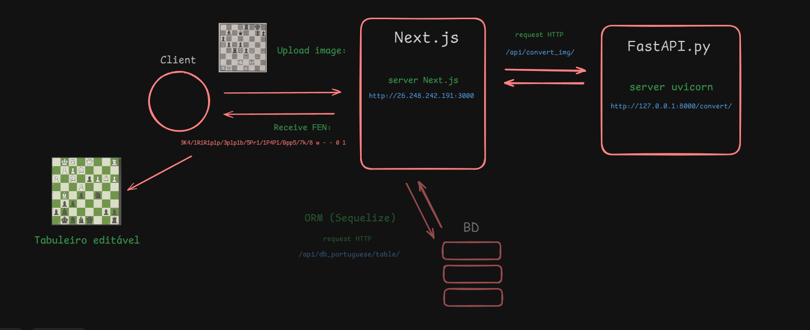
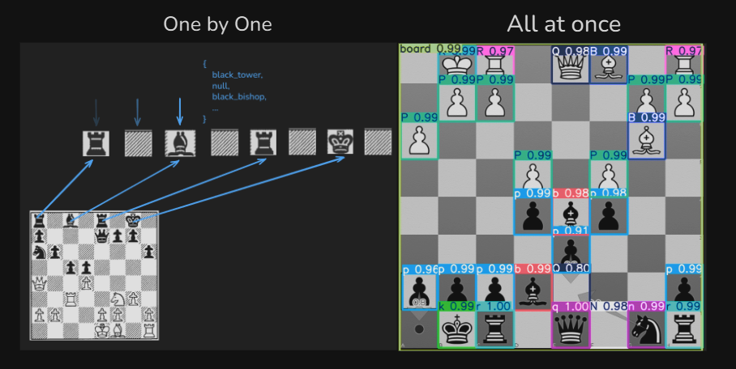
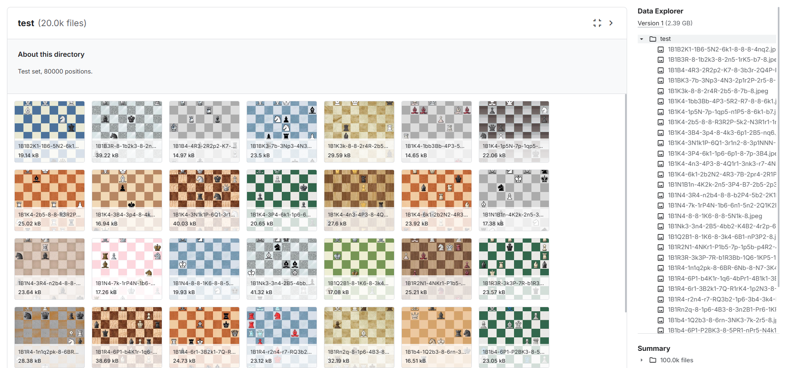
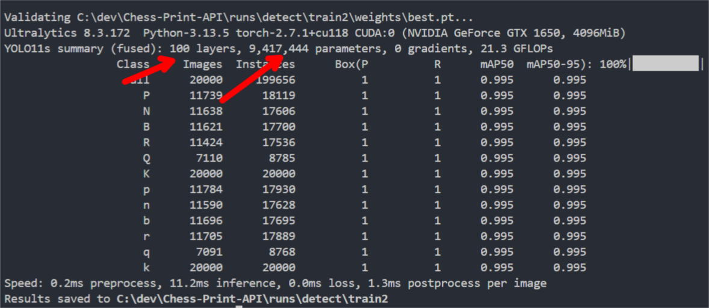
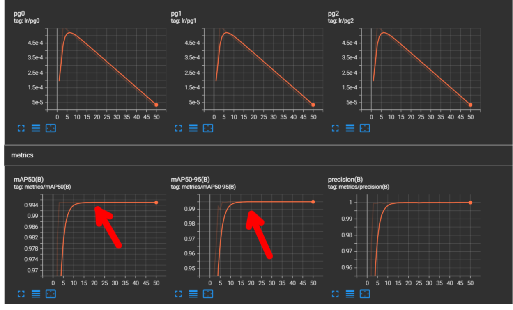
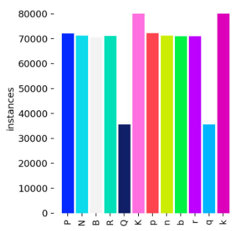
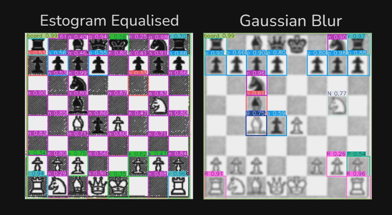
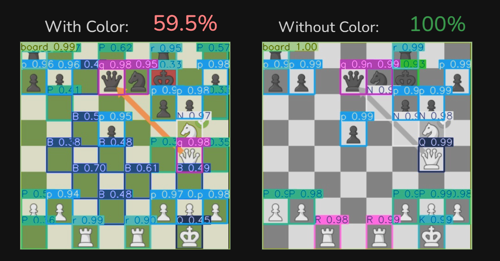

<a id="readme-top"></a>

<div align="center">
  <a href="https://github.com/Tawl-tack/Chess-Recognition">
    
  </a>

  ---
  <p align="center">
    <h3>AI System That Convert Images to Playable Chess-Boards</h3>
    <br />


  </p>
</div>

<br />

---
## About the Project

Chess Print is a open-source AI project that aims convert chess-board positions from old chess books - or just from prints - into online playable boards with high precision in low time.

<p align="right">(<a href="#readme-top">back to top</a>)</p>

---
### Usability


<p align="right">(<a href="#readme-top">back to top</a>)</p>

---
### Motivation

This idea comes from my own trouble to study by chess books. I spent a lot of time putting all the pieces one by one into random chess websites to study them. So I decided to learn ML (Machine Learning) and Computer Vision in order to automatize this manual work.

<p align="right">(<a href="#readme-top">back to top</a>)</p>

---
## Technologies Used

* **Frontend:**
  - **Javascript.**
  - **React.js.**
  - **Next.js.**
  - **react-chessboard & chess.js.**

* **Backend & APIs:**
  - **Next.js too.**
  - **Python.**
  - **FastAPI.**
  - **MySQL.** 

* **Machine Learning & Computer Vision:**
  - **Ultralytics (YOLOv8).**
  - **OpenCV & NumPy.**

<p align="right">(<a href="#readme-top">back to top</a>)</p>

---
## Installation

### Requirements
- Docker (Docker Compose v2 is included)

Verify installation:
```bash
docker --version
docker compose version
```

Install Docker (if it's not currently installed):
https://docs.docker.com/get-docker/

### How to run

```bash
git clone https://github.com/Higino-Neto/Chess-Print.git
cd Chess-Print
docker compose up -d
```

The system will open in:
http://localhost:3000
<p align="right">(<a href="#readme-top">back to top</a>)</p>

---
### Design System

First, the client uploads a chessboard image to the Next.js server, then it communicates with the intern API in Uvicorn using FastAPI. So it process the image with the YOLO11s model and return an FEN (Forsyth-Edwards Notation) with the information of where the pieces are. After this, React builds the iterative chessboard and shows it for the client. (The database also communicates with the Next.js, but it's not crucial for the main flow).



<p align="right">(<a href="#readme-top">back to top</a>)</p>

---
### Model Training

##### Decisions:
There are two ways of scanning a chessboard: (One by one and All at once)



One by one: You need to divide the chessboard in 64 pieces and iterate through them all.
All at once: You need to put the full normalized image into the already trained model.

I chose All at once because YOLO is optimized for it, but other models can be not, so be aware of it.

---
##### Dataset:
I tried a lot of datasets, but I acquire better results with this one with 100k images made by Pavel Koryakin: https://www.kaggle.com/datasets/koryakinp/chess-positions



---
##### Training:
I used a NVIDIA GeForce GTX 1650 4GB to train a YOLO11s model with 100 layers and 9,4 millions of parameters in 20 epochs and it took 12h to finish training.



(Obs1: YOLOv4, YOLOv8 and YOLO11t don't work as well as YOLO11s in this project, so feel free to make a fork of this repository and try YOLO11m or even YOLO11l if your GPU supports it).

(Obs2: I tried first with 50 epochs, but then I found a overfitting in it (And took 25h to train). After 20º epoch, the model starts to memorize noise patterns and loose precision in real tests). 



Also, because the queen of both sides is the piece that statistically less apears in boards, the amount of queens in the dataset is lower, then it can cause a little lose of performance in your tests (But I have no problem with it).



---
##### Data augmentation

I tried some image techniques to augment the data, like Estogram Equalised and Gaussian Blur, but neither worked well.



What really helped was removing colors:



<p align="right">(<a href="#readme-top">back to top</a>)</p>
  
  ---
## Contributing

Contributions are what make the open source community such an amazing place to learn, inspire, and create. Any contributions you make are **greatly appreciated**.
If you have a suggestion that would make this better, please fork the repo and create a pull request. You can also simply open an issue with the tag "enhancement".

Don't forget to give the project a star! Thanks again!

1. Fork the Project
2. Create your Feature Branch (`git checkout -b feature/AmazingFeature`)
3. Commit your Changes (`git commit -m 'Add some AmazingFeature'`)
4. Push to the Branch (`git push origin feature/AmazingFeature`)
5. Open a Pull Request

<p align="right">(<a href="#readme-top">back to top</a>)</p>
  
---
## 🌐 Contact

Higino P.C. Neto

Email:
higino.dev@gmail.com

Linkedin:
[](https://www.linkedin.com/in/higino-p-c-neto-7a353a363/)

<p align="right">(<a href="#readme-top">back to top</a>)</p>

---

[contributors-shield]: https://img.shields.io/github/contributors/othneildrew/Best-README-Template.svg?style=for-the-badge
[contributors-url]: https://github.com/othneildrew/Best-README-Template/graphs/contributors
[forks-shield]: https://img.shields.io/github/forks/othneildrew/Best-README-Template.svg?style=for-the-badge
[forks-url]: https://github.com/othneildrew/Best-README-Template/network/members
[stars-shield]: https://img.shields.io/github/stars/othneildrew/Best-README-Template.svg?style=for-the-badge
[stars-url]: https://github.com/othneildrew/Best-README-Template/stargazers
[issues-shield]: https://img.shields.io/github/issues/othneildrew/Best-README-Template.svg?style=for-the-badge
[issues-url]: https://github.com/othneildrew/Best-README-Template/issues
[license-shield]: https://img.shields.io/github/license/othneildrew/Best-README-Template.svg?style=for-the-badge
[license-url]: https://github.com/othneildrew/Best-README-Template/blob/master/LICENSE.txt
[linkedin-shield]: https://img.shields.io/badge/-LinkedIn-black.svg?style=for-the-badge&logo=linkedin&colorB=555
[linkedin-url]: https://linkedin.com/in/othneildrew
[product-screenshot]: images/screenshot.png
[Next.js]: https://img.shields.io/badge/next.js-000000?style=for-the-badge&logo=nextdotjs&logoColor=white
[Next-url]: https://nextjs.org/
[React.js]: https://img.shields.io/badge/React-20232A?style=for-the-badge&logo=react&logoColor=61DAFB
[React-url]: https://reactjs.org/
[Vue.js]: https://img.shields.io/badge/Vue.js-35495E?style=for-the-badge&logo=vuedotjs&logoColor=4FC08D
[Vue-url]: https://vuejs.org/
[Angular.io]: https://img.shields.io/badge/Angular-DD0031?style=for-the-badge&logo=angular&logoColor=white
[Angular-url]: https://angular.io/
[Svelte.dev]: https://img.shields.io/badge/Svelte-4A4A55?style=for-the-badge&logo=svelte&logoColor=FF3E00
[Svelte-url]: https://svelte.dev/
[Laravel.com]: https://img.shields.io/badge/Laravel-FF2D20?style=for-the-badge&logo=laravel&logoColor=white
[Laravel-url]: https://laravel.com
[Bootstrap.com]: https://img.shields.io/badge/Bootstrap-563D7C?style=for-the-badge&logo=bootstrap&logoColor=white
[Bootstrap-url]: https://getbootstrap.com
[JQuery.com]: https://img.shields.io/badge/jQuery-0769AD?style=for-the-badge&logo=jquery&logoColor=white
[JQuery-url]: https://jquery.com 


